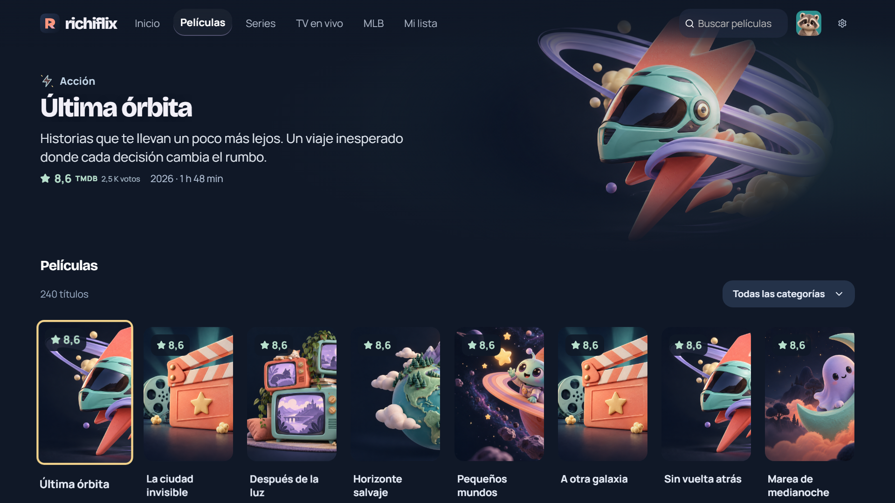
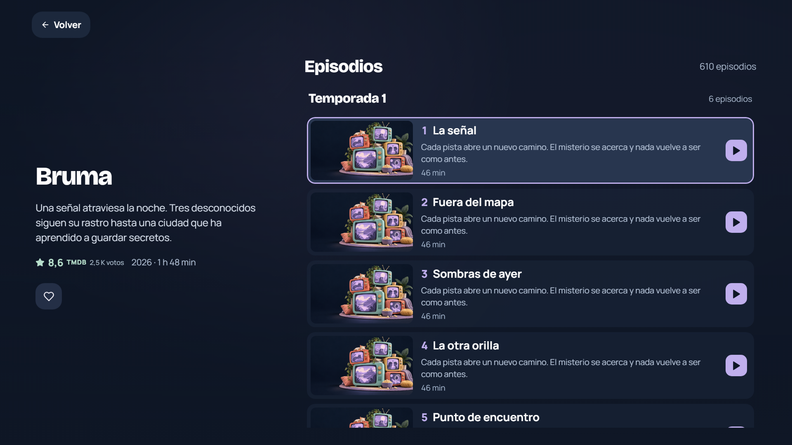
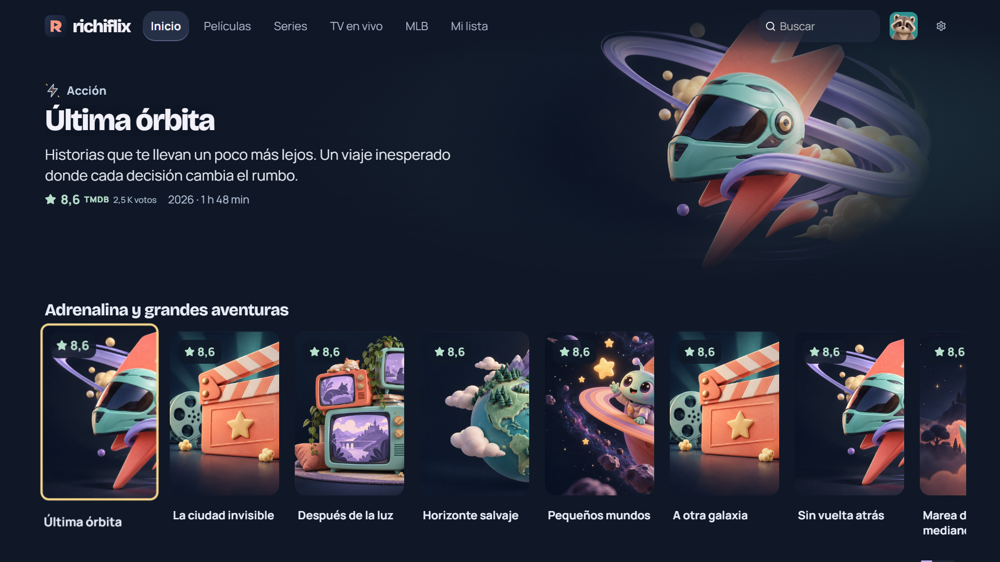
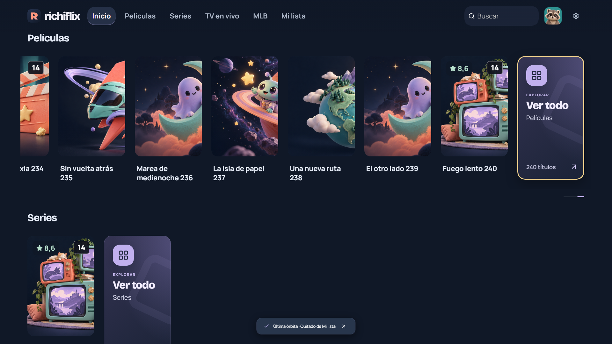
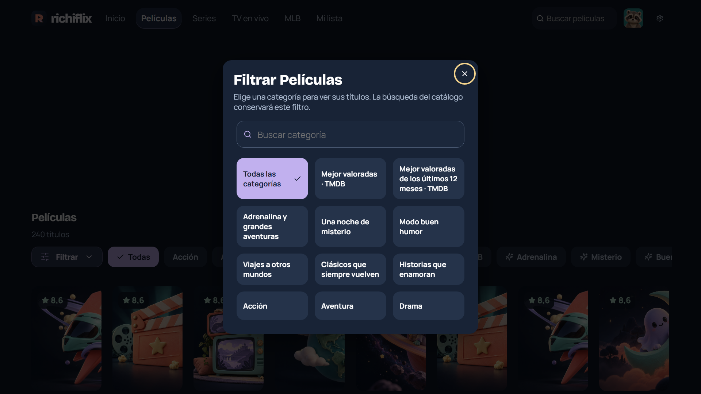
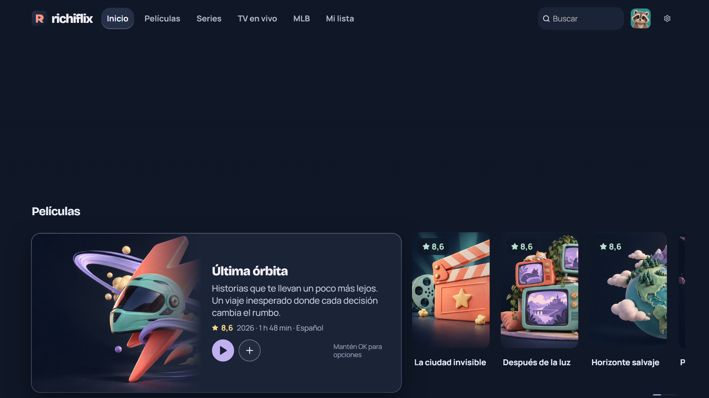
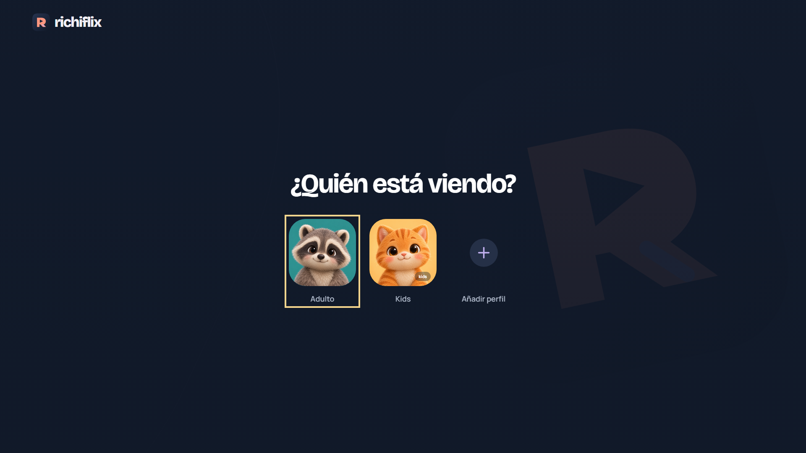

# Richiflix

Tu biblioteca local para Windows y Samsung TV. Películas, series y canales IPTV en una interfaz inmersiva, diseñada para navegar desde el sofá.



## La experiencia

- Portada integrada en el fondo, información en español y puntuaciones TMDB cuando están disponibles.
- Flechas, OK y Volver para recorrer el catálogo; el ratón también funciona en PC.
- Tarjetas amplias con sinopsis y puntuación: apartan a sus vecinas al seleccionarlas. Mantener OK abre sus acciones y en TV el tráiler disponible ocupa el banner y la tarjeta mantiene su imagen y sus datos.
- Carruseles circulares en ambos sentidos y una tarjeta «Ver todo» al final de cada fila, accesible con el mando.
- Películas y series por categorías, búsqueda, Mi lista e historial por perfil.
- TOP de películas y series de los últimos 12 meses, con puntuaciones TMDB.
- Colecciones que rotan al volver a Inicio o elegir «Otra selección»: misterio, comedia, clásicos, fantasía y más. Categorías con chips, accesibles con el mando y combinables con la búsqueda.
- Botón «Filtrar» con búsqueda de categorías; el género elegido se conserva al buscar títulos.
- Episodios en una lista continua agrupada por temporada, sin selector. Volver recupera el capítulo elegido.
- Perfiles locales Adulto y Kids. Kids exige evidencia de edad de hasta 10 años; un título sin clasificación confirmada queda oculto.
- Player por iconos, un único loader y controles adaptados a TV. El volumen en Samsung se gestiona con el mando.
- MLB: portadas de duelos compuestas con los escudos locales de los equipos y cuenta atrás de eventos con hora de Santiago.









[Cómo funcionan las colecciones y categorías](docs/COLECCIONES-HOME.md).



[Tarjetas ampliadas y navegación con el mando](docs/TARJETA-AMPLIADA.md).

[Animaciones y mediciones de rendimiento](docs/ANIMACIONES-RENDIMIENTO.md).

## Abrir en Windows

Necesitas Node.js 22.12 o posterior y npm.

```powershell
npm ci
npm run desktop
```

Crea un perfil y abre **Ajustes → Tus fuentes**. Introduce nombre, servidor, usuario y contraseña de tu conexión **Xtream Codes API**. Puedes agregar conexiones adicionales; cada título conserva su fuente para reproducir y obtener episodios. En **Sinopsis en español** puedes guardar tu API key o token de lectura TMDB.

El repositorio público empieza sin fuentes, claves ni contenido personal. Los cambios de login se guardan cifrados: Electron safeStorage en Windows y WebCrypto/IndexedDB en el widget. PC y TV conservan sus datos por separado. Las capturas usan títulos, puntuaciones y episodios ficticios de demostración; no son un catálogo incluido en la aplicación.

Para trabajar en la interfaz: `npm run dev`. Para generar el acceso directo de Windows: `npm run windows:shortcut`, después de compilar.

## Samsung TV · Tizen

El destino es un widget Web para **Tizen 6.5+**. Comparte la interfaz con Windows y utiliza **AVPlay** para reproducir en Samsung.

```powershell
npm run build:tizen
```

Genera `artifacts/Richiflix-Tizen-unsigned.wgt`. Para instalar necesitas el SDK, un perfil Samsung y el DUID del televisor. [Guía de instalación](docs/TIZEN.md).

Los tráilers del widget requieren configurar y comprobar el puente HTTP(S) de YouTube en tu dispositivo. [Puente de tráilers](trailer-bridge/README.md). La compilación y las pruebas simuladas no garantizan la disponibilidad de una emisión, sus códecs ni el autoplay en un modelo concreto.

## Rendimiento

Las listas tienen desplazamiento infinito y ventanas virtuales: los títulos lejanos se retiran del DOM. La precarga prepara el área visible y al menos las dos próximas filas, comparte una cola de dos solicitudes y se pausa al navegar rápido. Las puntuaciones tienen un caché persistente separado, de hasta 5.000 entradas durante siete días. Los episodios conservan un caché limitado de ocho series durante 30 minutos.

En navegador/Tizen, el catálogo, las fuentes y los metadatos se procesan en un worker; Electron utiliza su proceso principal mediante IPC. El banner conserva la geometría del catálogo, espera una pausa al navegar y reutiliza el reproductor del tráiler. Las imágenes aparecen tras decodificar y validar su resolución. Mientras cargan se muestra un spinner; el arte alternativo se reserva para la ausencia o el fallo confirmado.

Las sinopsis en español se conservan hasta 30 días, con un límite de 2.000 títulos y 6 MiB. Las portadas TMDB se guardan comprimidas en un caché independiente de hasta 48 MiB y 14 días, con limpieza automática y trabajo en segundo plano. Las imágenes ya guardadas se reutilizan tras reiniciar; los vídeos siguen por streaming. [Caché de previews](docs/CACHE-PREVIEWS.md).



## Comprobar en PC

```powershell
npm test
npm run build
npx playwright install chromium
npm run test:pc
node electron/smoke.cjs
```

Las pruebas usan datos temporales y respuestas simuladas. La prueba de episodios recorre 610 capítulos manteniendo como máximo 12 botones montados; también comprueba precarga, búsqueda con keycodes del mando, filtros de categorías, rotación persistente y regreso desde reproducción. **No conecta ni instala en un TV.** [Informe de validación](docs/VALIDACION-PC-20261006.md).

## Diseño y recursos

Tinta, coral y lavanda; Bricolage Grotesque para títulos y Manrope para lectura. Iconos vectoriales e ilustraciones locales, sin emojis. [Diseño de episodios](docs/DISENO-EPISODIOS-TV.md).

Las marcas, fuentes y logos externos pertenecen a sus respectivos titulares. Los escudos MLB se obtienen de sus recursos oficiales mediante `scripts/update-mlb-logos.mjs`. TMDB se usa para metadatos: This product uses the TMDB API but is not endorsed or certified by TMDB.
